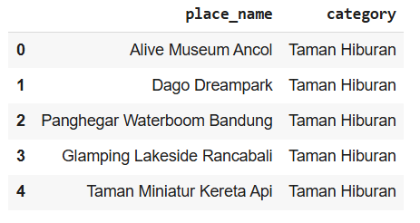
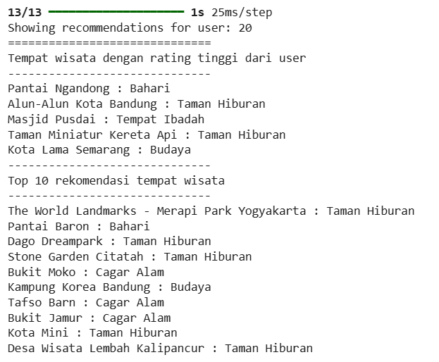
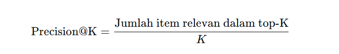
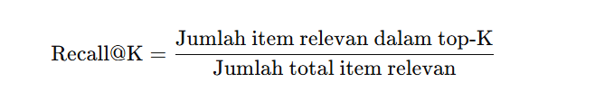
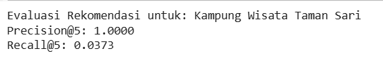
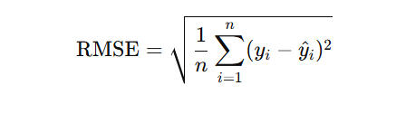
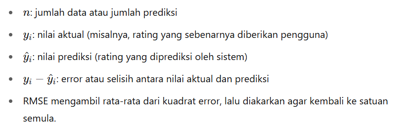
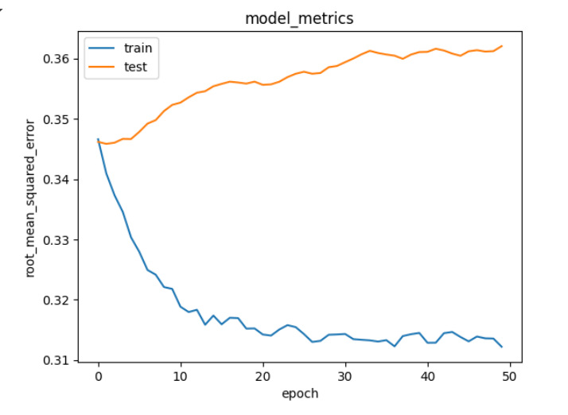

# Laporan Proyek Machine Learning - Aisyah Amelia Zarah Juaita

# Project Overview

## Latar Belakang

Indonesia merupakan negara yang kaya akan destinasi wisata. Namun, banyak wisatawan kesulitan menemukan destinasi yang sesuai dengan preferensi mereka. Untuk itu, sistem rekomendasi tempat wisata sangat dibutuhkan untuk membantu pengguna dalam menentukan tujuan wisata berdasarkan histori dan minat mereka.

## Pentingnya Proyek

Pentingnya proyek ini terletak pada kemampuannya untuk meningkatkan pengalaman pengguna dalam memilih destinasi wisata, mempercepat proses pencarian tempat wisata yang relevan, serta mendorong sektor pariwisata secara keseluruhan.

## Referensi

- Ricci, Rokach, & Shapira (2015). Recommender Systems Handbook.

- Dataset: Kaggle Indonesia Tourism Destination

# Business Understanding

## Problem Statements

1. Bagaimana sistem dapat merekomendasikan tempat wisata yang sesuai dengan preferensi pengguna?

2. Bagaimana cara meningkatkan relevansi rekomendasi menggunakan pendekatan yang berbeda?
   
3. Pendekatan mana yang lebih efektif: content-based atau collaborative filtering?

## Goals

1. Mengembangkan sistem rekomendasi tempat wisata.

2. Menyajikan dua pendekatan berbeda: content-based filtering dan collaborative filtering.

3. Memberikan output rekomendasi Top-N destinasi untuk setiap pengguna.

## Solution Statements

1. Content-Based Filtering
   Menggunakan informasi atribut dari tempat wisata (seperti kategori, deskripsi, lokasi) untuk 
   menemukan kesamaan antar tempat, kemudian merekomendasikan tempat yang mirip dengan yang 
   disukai user sebelumnya.

2. Collaborative Filtering
   Menggunakan interaksi antar pengguna dan tempat wisata untuk menemukan pola kesukaan. 
   Pendekatan ini memanfaatkan teknik matrix factorization (seperti SVD) untuk merekomendasikan 
   tempat yang disukai pengguna serupa.

# Data Understanding

Proyek ini menggunakan dataset Indonesia Tourism Destination yang tersedia di Kaggle:

🔗 https://www.kaggle.com/datasets/aprabowo/indonesia-tourism-destination

## Informasi Dataset

1. tourism_rating.csv: memiliki 10.000 baris dan memiliki 3 kolom
2. tourism_with_id.csv: memiliki 437 baris dan memiliki 13 kolom
3. user.csv: memiliki 300 baris dan memiliki 3 kolom

## Exploratory Data Analysis

- Tourism Rating Variabel
  
  "tourism_rating.head()"

Pada bagian ini Dataset tourism_rating berisi data interaksi antara pengguna dan tempat wisata dalam bentuk rating. Setiap baris merepresentasikan satu penilaian yang diberikan oleh pengguna (User_Id) terhadap suatu destinasi wisata (Place_Id) dengan skor tertentu pada kolom Place_Ratings.

   "tourism_rating.info()"
  
Hasil dari tourism_rating.info() menunjukkan bahwa dataset terdiri dari 10.000 baris dan 3 kolom: User_Id, Place_Id, dan Place_Ratings. Semua kolom bertipe data int64 dan tidak memiliki missing value (nilai kosong). Ini berarti data bersih dan siap digunakan untuk analisis atau pelatihan model rekomendasi tanpa perlu proses imputasi atau pembersihan tambahan.

- Tourism Variabel

   "tourism.head()"

Dataset `tourism` berisi informasi detail tentang destinasi wisata. Setiap baris merepresentasikan satu tempat wisata, dengan kolom-kolom seperti `Place_Id` (ID tempat), `Place_Name` (nama tempat), `Description` (deskripsi), `Category` (jenis wisata), `City` (kota), `Price` (harga tiket), `Rating` (nilai rating umum), `Time_Minutes` (perkiraan durasi kunjungan), serta koordinat geografis (`Lat` dan `Long`). Terdapat juga kolom `Coordinate` dalam format dictionary, dan dua kolom tambahan (`Unnamed: 11` dan `Unnamed: 12`) yang tampaknya tidak terpakai atau hasil dari proses ekspor. Data ini penting untuk sistem rekomendasi berbasis konten karena menyediakan fitur-fitur yang bisa digunakan untuk mengukur kemiripan antar tempat wisata.

   "tourism.info()"

Hasil `tourism.info()` menunjukkan bahwa dataset memiliki 437 entri dan 13 kolom. Sebagian besar kolom terisi penuh, kecuali `Time_Minutes` yang hanya memiliki 205 nilai (mengandung banyak missing value) dan `Unnamed: 11` yang seluruhnya kosong. Kolom seperti `Place_Id`, `Place_Name`, `Description`, `Category`, dan `City` menyimpan informasi utama tentang tempat wisata, sedangkan `Price`, `Rating`, `Lat`, dan `Long` memberikan data numerik terkait lokasi dan preferensi. Kolom `Unnamed: 11` sebaiknya dihapus karena tidak mengandung informasi. Dataset ini cocok digunakan untuk analisis konten destinasi wisata dan visualisasi lokasi.

- User Variabel

   "user.head()"

Dataset `user` berisi informasi tentang pengguna yang memberikan rating pada tempat wisata. Setiap baris mencakup `User_Id` (ID unik pengguna), `Location` (asal kota dan provinsi), serta `Age` (usia pengguna). Data ini berguna untuk analisis demografis dan dapat dimanfaatkan dalam sistem rekomendasi berbasis pengguna (collaborative filtering) atau untuk personalisasi rekomendasi berdasarkan lokasi dan usia.

   "user.info()"

Hasil `user.info()` menunjukkan bahwa dataset berisi 300 entri dengan 3 kolom: `User_Id`, `Location`, dan `Age`. Semua kolom memiliki data lengkap (tidak ada missing value). `User_Id` dan `Age` bertipe numerik (`int64`), sementara `Location` bertipe teks (`object`). Dataset ini bersih dan siap digunakan untuk analisis atau pemodelan, terutama dalam sistem rekomendasi berbasis pengguna atau segmentasi berdasarkan lokasi dan usia.

- Melihat Statistik Unik

Terdapat output yang dihasilkan: 

- Jumlah user unik: 300
- Jumlah tempat wisata unik: 437

## Variabel-Variabel pada Dataset

1. tourism_rating:

    1. `User_Id` - ID unik yang merepresentasikan pengguna yang memberi rating.
    2. `Place_Id``- ID unik untuk setiap tempat wisata yang diberi rating.
    3. `Place_Ratings` - Nilai rating (penilaian) yang diberikan user terhadap tempat wisata 
        tersebut (biasanya skala 1-5).

2. tourism:
    1. `Place_Id` - ID unik tempat wisata (digunakan sebagai kunci relasi).
    2. `Place_Name` - Nama tempat wisata.
    3. `Description` - Deskripsi singkat tempat wisata.
    4. `Category` - Kategori tempat wisata.
    5. `City` - Kota tempat wisata berada.
    6. `Price` - Estimasi harga tiket masuk atau biaya kunjungan.
    7. `Rating` - Rating umum atau popularitas tempat.
    8. `Time_Minutes` - Estimasi waktu kunjungan dalam menit (durasi).
    9. `Coordinate` - Lokasi geografis gabungan (lat-long dalam satu string).
    10. `Lat` - Latitude tempat wisata (lintang).
    11. `Long` - Longitude tempat wisata (bujur).
    12. `Unnamed: 11` - Kolom kosong.
    13. `Unnamed: 12` - Kolom kosong.

3. user:

    1. `User_Id` - ID unik pengguna.
    2. `Location` - Lokasi pengguna (bisa berupa kota, provinsi, atau nama tempat tinggal).
    3. `Age` - 	Umur pengguna.

# Data Preparation

## Pembersihan dan Penggabungan Data

- Menggabungkan Semua Tempat (placeID Unik)

Menghasilkan output: Jumlah seluruh tempat wisata unik berdasarkan Place_Id: 437, yang dimana Tahap ini digunakan untuk memperoleh seluruh ID tempat wisata unik dari dataset tourism. Pertama, Place_Id diambil dan diubah menjadi array unik menggunakan np.unique(), lalu diurutkan dengan np.sort(). Hasil akhirnya menunjukkan bahwa terdapat 437 tempat wisata unik berdasarkan kolom Place_Id, yang sesuai dengan jumlah tempat wisata dalam dataset.

- Menggabungkan Semua User

Menghasilkan output: Jumlah seluruh user unik: 300, yang dimana tahap ini menggabungkan seluruh ID pengguna (User_Id) dari dua dataset: tourism_rating dan user. Setelah digabung, kode menggunakan np.unique() untuk menghapus duplikat, lalu mengurutkan hasilnya. Hasil akhirnya menunjukkan bahwa terdapat 300 pengguna unik secara keseluruhan.

- Melihat Jumlah Rating

Menghasilkan output: 

Jumlah data rating: 10000

Cek missing value:
User_Id          0
Place_Id         0
Place_Ratings    0
dtype: int64

Yang dimana pada tahap ini menampilkan jumlah total data rating dalam dataset `tourism_rating`, yaitu 10.000 baris. Selain itu, pengecekan missing value menunjukkan bahwa tidak ada nilai yang hilang pada kolom `User_Id`, `Place_Id`, maupun `Place_Ratings`, sehingga data lengkap dan siap digunakan untuk analisis atau pemodelan.

- Gabungkan Rating dengan Nama Tempat

Pada tahap ini melakukan beberapa langkah penting untuk memudahkan analisis data. Pertama, kolom `Place_Id` dan `Place_Name` pada dataset `tourism` diganti namanya menjadi `placeID` dan `name` agar konsisten dengan dataset `tourism_rating` yang juga diubah kolom `Place_Id` dan `User_Id` menjadi `placeID` dan `userID`. Selanjutnya, kedua dataset tersebut digabung (`merge`) berdasarkan kolom `placeID` untuk menggabungkan data rating dengan informasi nama tempat wisata dan kategorinya. Hasilnya adalah tabel yang berisi ID pengguna, ID tempat, nilai rating, nama tempat wisata, dan kategori, sehingga memudahkan analisis dan rekomendasi berbasis konten dan rating.

- Gabungkan Data dengan Profil User

Pada tahap ini menggabungkan data pengguna (user) dengan data rating dan informasi tempat wisata (all_place_name) berdasarkan kolom userID. Sebelumnya, kolom User_Id pada dataset user diubah menjadi userID agar konsisten. Hasil penggabungan (all_data) berisi informasi lengkap yang mencakup ID pengguna, ID tempat, rating, nama tempat, kategori, serta data demografis pengguna seperti lokasi dan usia. Data ini siap untuk analisis lebih lanjut, misalnya untuk personalisasi rekomendasi berdasarkan profil pengguna.

- Cek Data Akhir & Missing Value

Tahapan ini memeriksa apakah terdapat nilai yang hilang (missing values) dalam dataset gabungan `all_data`. Hasilnya menunjukkan bahwa tidak ada missing value di semua kolom, sehingga data lengkap dan siap digunakan untuk analisis atau pemodelan tanpa perlu penanganan data kosong lebih lanjut.

## Content Based Filtering

1. TF-IDF Vectorizer

Kolom category dari dataset tourism_new diubah menjadi representasi numerik menggunakan teknik TF-IDF (Term Frequency - Inverse Document Frequency) dengan bantuan TfidfVectorizer dari Scikit-learn.

- Langkah-langkah yang dilakukan:

  1. Inisialisasi objek TfidfVectorizer.
  2. Melakukan fit dan transform terhadap kolom category untuk menghasilkan matriks TF-IDF yang 
     merepresentasikan kategori tempat wisata sebagai vektor.
  3. Matriks TF-IDF ini menunjukkan seberapa penting suatu kata (kategori) dalam konteks 
     seluruh data tempat wisata.
  4. Matriks hasil transformasi kemudian dikonversi menjadi bentuk dense (padat) agar dapat 
     divisualisasikan dan dianalisis.

2. Cosine Similarity

Setelah diperoleh matriks TF-IDF, dilakukan perhitungan cosine similarity untuk mengukur tingkat kemiripan antar destinasi wisata berdasarkan vektor kategori mereka.

- Langkah-langkahnya:
  
  1. Menggunakan cosine_similarity() dari sklearn.metrics.pairwise untuk menghitung nilai 
     kemiripan antar baris dalam matriks TF-IDF.
  2. Hasil perhitungan disimpan dalam cosine_sim, yaitu matriks berukuran jumlah tempat wisata  
     jumlah tempat wisata yang menyatakan seberapa mirip dua tempat satu sama lain.
  3. Matriks ini dikonversi ke dalam bentuk DataFrame (cosine_sim_df) dengan label baris dan 
     kolom berupa nama tempat wisata, sehingga dapat digunakan untuk pencarian berdasarkan nama 
     destinasi.

Matriks cosine_sim_df kemudian digunakan dalam fungsi tourism_recommendations() yang dapat memberikan rekomendasi destinasi wisata yang mirip dengan tempat yang dicari pengguna. Sebagai contoh, ketika pengguna memasukkan nama "Kampung Wisata Taman Sari", sistem akan mengembalikan 5 destinasi teratas yang memiliki nilai kemiripan tertinggi berdasarkan kategorinya.

3. Pelatihan Model

Model melatih pada *Kampung Wisata Taman Sari* menunjukkan Precision\@5 = 1.0, artinya semua rekomendasi relevan. Namun, Recall\@5 = 0.0373, menandakan hanya sebagian kecil tempat relevan yang berhasil direkomendasikan. Sistem sangat tepat, tapi masih terbatas dalam cakupan.

## Collaborative Filtering

1. Encoding userID dan placeID

Sebelum digunakan dalam model pembelajaran, kolom userID dan placeID dikonversi menjadi representasi numerik menggunakan dictionary encoding:

   - userID diubah menjadi user melalui pemetaan dictionary (user_to_user_encoded).
   
   - placeID diubah menjadi place melalui pemetaan dictionary (place_to_place_encoded).

Proses encoding ini penting karena model embedding hanya dapat memproses input numerik, bukan string atau ID kategori.

2. Normalisasi Rating

Nilai Place_Ratings awalnya berada dalam rentang 1 hingga 5. Agar lebih stabil dalam proses pelatihan neural network, nilai ini dinormalisasi ke rentang 0 hingga 1. Hal ini mencegah bias terhadap rating tinggi dan membantu model belajar secara lebih merata.

3. Training dan Validation

Dataset kemudian dibagi menjadi:

- 80% data pelatihan

- 20% data validasi

Tujuannya adalah untuk memastikan bahwa model tidak hanya belajar dari data yang sudah pernah dilihat, tapi juga diuji kemampuannya pada data baru.

4. Model Embedding: RecommenderNet

Model rekomendasi didefinisikan menggunakan TensorFlow dengan arsitektur embedding:

   - Masing-masing pengguna dan tempat wisata di-embed ke dalam vektor berdimensi 50.
   - Dot product antara vektor user dan place menentukan skor prediksi.
   - Model juga memanfaatkan bias untuk masing-masing entitas.
   - Aktivasi sigmoid digunakan di akhir untuk membatasi prediksi dalam rentang 0–1.

5. Pelatihan Model

Model dilatih menggunakan fungsi loss BinaryCrossentropy dan metrik RootMeanSquaredError (RMSE) untuk mengukur kesalahan prediksi. Model dilatih selama 50 epoch dengan batch size 8.

# Modeling

## 1. Content Based Filtering

- Modeling:

  1. Menggunakan informasi deskriptif berupa kategori dari setiap tempat wisata (category).
  2. Diterapkan teknik TF-IDF Vectorization untuk mengubah kategori tempat wisata menjadi 
     representasi numerik.
  3. Kemudian digunakan cosine similarity untuk menghitung tingkat kemiripan antar destinasi 
     berdasarkan vektor TF-IDF-nya.
  4. Model akan memberikan Top-N rekomendasi tempat wisata yang paling mirip dengan tempat yang 
     dipilih pengguna.

- Hasil Output:

Ketika pengguna memilih “Kampung Wisata Taman Sari”, sistem akan menampilkan 5 tempat wisata lain yang memiliki kategori serupa.

- Kelebihan
  1. Tidak memerlukan data rating pengguna.
  2. Cocok untuk sistem dengan jumlah pengguna yang masih sedikit.
  3. Interpretatif: dapat diketahui alasan tempat direkomendasikan (karena kemiripan kategori).
     
- Kekurangan
  1. Tidak mempertimbangkan preferensi personal pengguna.
  2. Rekomendasi hanya berdasarkan konten, sehingga tidak bisa menyesuaikan selera unik tiap 
     individu.
     
## 2. Collaborative Filtering

- Modeling:
  1. Menggunakan data interaksi antara pengguna (userID) dan tempat wisata (placeID) dalam 
     bentuk rating.
  2. Setiap userID dan placeID diencoding ke format numerik.
  3. Model neural network dengan embedding layer dibangun menggunakan TensorFlow/Keras untuk 
     mempelajari representasi dari user dan tempat wisata.
  4. Digunakan fungsi dot product untuk memprediksi skor kecocokan antara user dan destinasi.

- Hasil Output:
  1. Sistem menghasilkan Top-10 tempat wisata yang belum pernah dikunjungi oleh user, 
     berdasarkan prediksi rating tertinggi.
  2. Rekomendasi disesuaikan dengan preferensi pengguna berdasarkan riwayat interaksinya.

-  Kelebihan
   1. Menghasilkan rekomendasi yang lebih personal sesuai dengan pola pengguna.
   2. Bisa menemukan destinasi yang menarik bagi user walaupun tidak mirip secara konten.

- Kekurangan
  1. Membutuhkan banyak data interaksi pengguna agar akurat.
  2. Rentan terhadap cold-start problem untuk pengguna baru atau destinasi baru yang belum 
     memiliki rating.

# Evaluation

Pada proyek ini menggunakan dua model yaitu Content Based Filtering dan Collaborative Filtering.

### Content Based Filtering

1. Metrik Evaluasi yang digunakan:

- Precision@K

Precision@K mengukur proporsi item relevan (misalnya, dengan kategori yang sama) di antara K rekomendasi teratas yang diberikan oleh sistem.
Rumus:

- Recall@K

Recall@K mengukur proporsi item relevan yang berhasil ditemukan oleh sistem dari seluruh item relevan yang tersedia.
Rumus:

2. Hasil Evaluasi Model:

Evaluasi dilakukan untuk tempat wisata Kampung Wisata Taman Sari (kategori: Taman Hiburan), dengan menggunakan Precision@K dan Recall@K dengan nilai K = 5. Dapat dilihat dari output yang dihasilkan di bawah ini:

3. Penjelasan:

- Precision@5 = 1.0000
  
Artinya, 100% dari 5 rekomendasi teratas memiliki kategori yang sama dengan tempat wisata yang dijadikan acuan (Taman Hiburan).
Ini menunjukkan bahwa sistem sangat tepat dalam memilih tempat wisata serupa berdasarkan konten kategorinya.

- Recall@5 = 0.0373
  
Nilai ini mengindikasikan bahwa dari seluruh tempat wisata yang relevan (134 tempat dengan kategori Taman Hiburan), hanya sekitar 3.73% yang berhasil ditampilkan di 5 rekomendasi teratas.
Hal ini wajar dalam sistem rekomendasi, karena recall akan meningkat seiring bertambahnya jumlah rekomendasi (K).

###  Collaborative Filtering.

1. Metrik Evaluasi yang digunakan: 

- Root Mean Squared Error (RMSE)
Metrik ini digunakan untuk mengukur seberapa jauh prediksi rating dari model terhadap rating sebenarnya. Dengan Rumus:

- Penjelasan:

RMSE adalah turunan dari Mean Squared Error (MSE) dan sangat umum digunakan dalam masalah regresi dan sistem rekomendasi berbasis rating.

2. Hasil Evaluasi Model

Model training menggunakan data x_train dan y_train, dan divalidasi dengan x_val dan y_val. Proses training dilakukan selama 50 epoch, dan performa model dipantau menggunakan RMSE pada data training dan validasi.

Berdasarkan hasil plot yang ditampilkan dalam notebook:

- RMSE pada training set menunjukkan penurunan stabil selama epoch berlangsung, menandakan 
  model belajar dari data.
- RMSE pada validation set juga menunjukkan performa yang stabil, tanpa overfitting yang 
  signifikan.

- Penjelasan:

1. Deskripsi:
   
Grafik menunjukkan nilai Root Mean Squared Error (RMSE) pada data train dan test (validasi) selama 50 epoch pelatihan model:

- Sumbu X: Jumlah epoch (iterasi pelatihan).

- Sumbu Y: Nilai RMSE.

- Garis biru: RMSE pada data training.

- Garis oranye: RMSE pada data validasi (test set).

2. Interpretasi:

- Training Error (RMSE - Biru):
   1. Menurun secara signifikan dari sekitar 0.345 ke sekitar 0.312 selama pelatihan.
   2. Menunjukkan bahwa model berhasil mempelajari pola dari data training secara efektif.

- Validation Error (RMSE - Oranye):
   1. Awalnya mirip dengan training error, namun cenderung naik setelah beberapa epoch awal.
   2. Mulai dari 0.345 dan meningkat hingga sekitar 0.362 di akhir pelatihan.
   3. Fenomena ini merupakan indikasi overfitting, yaitu model terlalu menyesuaikan diri 
      dengan data training, sehingga kemampuan generalisasi terhadap data baru menurun.

# Evaluasi Terhadap Business Understanding

- Kesesuaian dengan Problem Statement

Problem statements yang diajukan sangat relevan dengan domain pariwisata, khususnya dalam konteks personalisasi pengalaman pengguna melalui sistem rekomendasi. Permasalahan yang ingin diselesaikan yakni bagaimana merekomendasikan tempat wisata yang sesuai dengan preferensi pengguna dapat dipecahkan secara teknis melalui dua pendekatan utama yang digunakan dalam notebook yaitu content-based filtering dan collaborative filtering. 

- Kesesuian dengan Goals

Seluruh tujuan proyek berhasil dicapai dengan baik. Sistem rekomendasi tempat wisata berhasil dikembangkan dan dijalankan menggunakan dataset nyata. Dua pendekatan utama, yaitu content-based filtering dan collaborative filtering, telah berhasil diterapkan untuk memberikan variasi solusi. Selain itu, sistem mampu menghasilkan output rekomendasi Top-N destinasi wisata yang sesuai berdasarkan input atau preferensi pengguna.

- Solusi

Dengan rekomendasi yang lebih relevan dan terpersonalisasi, pengguna dapat menjelajahi destinasi wisata yang sesuai dengan minat mereka, sehingga meningkatkan kualitas pengalaman pengguna dan kepuasan dalam merencanakan perjalanan. Pendekatan ini juga membuka peluang bagi platform wisata untuk meningkatkan keterlibatan pengguna dan retensi aplikasi.

# Kesimpulan

Proyek ini berhasil membangun sistem rekomendasi tempat wisata menggunakan dua pendekatan: content-based filtering dan collaborative filtering. Content-based filtering memanfaatkan informasi kategori destinasi untuk mengukur kesamaan antar tempat menggunakan TF-IDF dan cosine similarity, sedangkan collaborative filtering memanfaatkan data interaksi pengguna dan tempat wisata melalui pendekatan matrix factorization. Kedua metode berhasil menghasilkan rekomendasi Top-N yang relevan dan personal. Evaluasi menggunakan Root Mean Squared Error (RMSE) menunjukkan bahwa model collaborative filtering cukup akurat, meskipun terdapat potensi overfitting pada data validasi. Secara keseluruhan, sistem ini memberikan solusi efektif untuk membantu pengguna menemukan destinasi wisata sesuai preferensi mereka.

